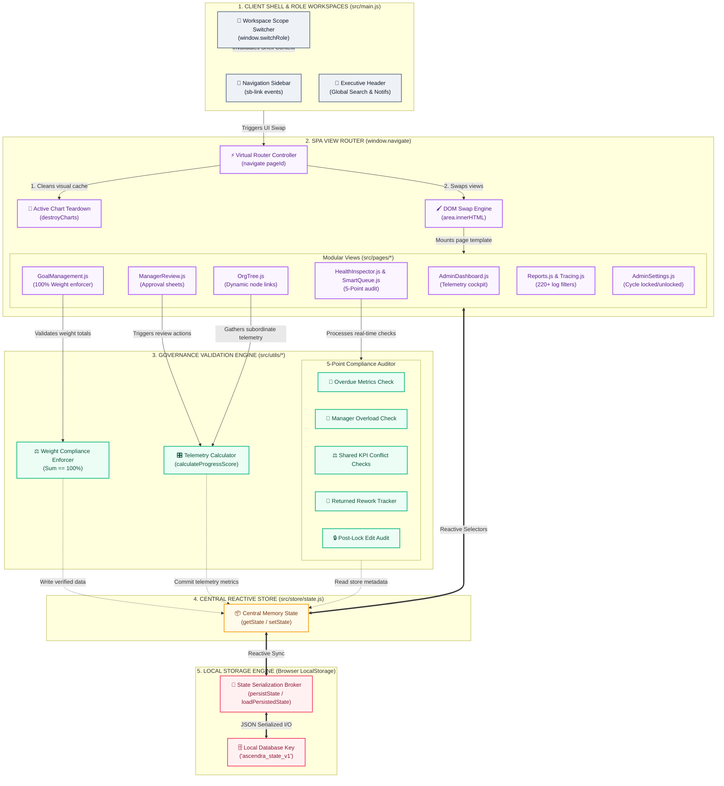
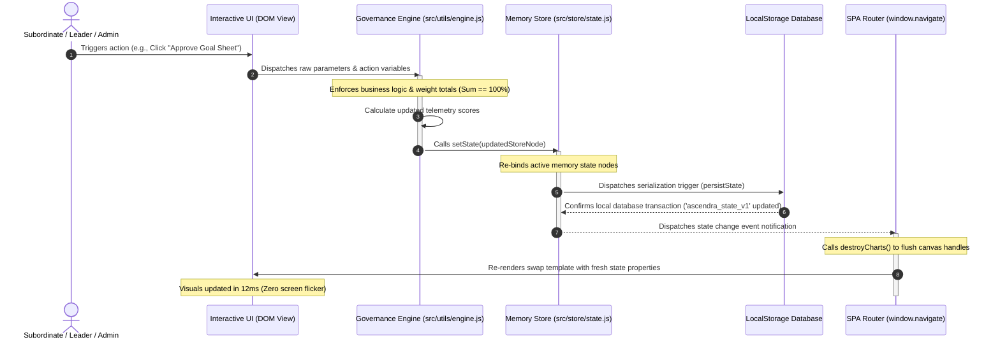

# 🏛️ ASCENDRA — HIGH-LEVEL SYSTEM ARCHITECTURE
### Master Engineering Topography, Reactive Pipeline, & Governance Sequence

---

This document outlines the master technical architecture of **Ascendra — Enterprise Performance & Observability Cockpit**. The system is engineered to deliver zero-latency client-side state synchronization, strict mathematical goal validations, and comprehensive audit tracing entirely inside the browser.

---

## 1. Modular System Topology Map

The diagram below maps the runtime topography of Ascendra, highlighting the visual layers, ES Module boundaries, logic triggers, and the underlying persistence layers:



---

## 2. Reactive State Mutation & DOM-Swap Pipeline

Every single user event (e.g., modifying goal metric progress, switching cycle phases, adding comments, approving sheets) undergoes a strict visual-integrity loop:



---

## 3. Comprehensive Enterprise Governance Sequence Loop

This sequence diagram maps the standard planning cycle workflow: Employee drafting and submission, Manager governance and rework flows, and Administrative cycle lockdowns.

```mermaid
sequenceDiagram
    autonumber
    actor Emp as Employee (Morgan Blake)
    actor Mgr as Department Manager
    actor Admin as Platform Admin
    participant State as Local Store Engine
    participant SmartQ as Smart Intervention Queue

    %% Phase 1: Goal Drafting
    Note over Admin, State: Phase 1: Cycle Phase set to 'GOAL_SETTING' (Cycle Unlocked)
    Emp->>State: Adds new strategic goal (e.g., Target: 98% execution)
    Emp->>State: Saves goals in 'DRAFT' status
    
    %% Weight Check Trigger
    Emp->>State: Clicks 'Submit for Approval'
    Note over State: Performs mathematical weight audit
    alt Weight Total != 100%
        State-->>Emp: Enforces validation block (Goal sum must equal 100%)
    else Weight Total == 100%
        State->>State: Sets sheet status to 'SUBMITTED'
        State-->>Emp: Locks form inputs (opacity set to 0.5; pointer-events disabled)
        State->>SmartQ: Sweeps managers; Overload Check evaluates active reviews
    end

    %% Phase 2: Manager Review Loop
    Note over Mgr, State: Phase 2: Manager enters Review Terminal
    alt Goal Targets are Disproportionate
        Mgr->>State: Inputs rework comments & clicks 'Return for Rework'
        State->>State: Sets status to 'RETURNED'
        State-->>Emp: Unlocks form inputs in Employee panel with rework notes
    else Goal Targets Approved
        Mgr->>State: Clicks 'Approve Sheet'
        State->>State: Sets status to 'APPROVED'
        State-->>Emp: Locks sheet in final audited state
    end

    %% Phase 3: Lock-down
    Admin->>State: Shifts cycle phase to 'MID_QUARTER_REVIEW' & Sets 'cycleLocked: true'
    State->>State: Restricts all subordinate draft inputs globally
    alt User attempts Post-Audit modification
        Emp->>State: Modifies performance progress metrics
        State->>SmartQ: Flags event in Post-Lock Changes Audit
    end

```

---

## 4. Technical File Responsibility Matrix

The core mechanics are cleanly distributed across these files to maintain modularity:

| Module / File Path | Responsibility | Core Implementation Details |
| :--- | :--- | :--- |
| **[`src/store/state.js`](file:///c:/Users/LAUKIK/Desktop/AtomBerg/src/store/state.js)** | Central Store & Persistence | Manages rehydration, contains the default seed data (60+ goals, 220+ logs), and handles `localStorage` saves under `ascendra_state_v1`. |
| **[`src/main.js`](file:///c:/Users/LAUKIK/Desktop/AtomBerg/src/main.js)** | Application Bootstrapper & Routing | Binds navigation, compiles workspace shells (`buildShell`), handles role switching (`switchRole`), and drives DOM swaps (`window.navigate`). |
| **[`src/styles/dashboard.css`](file:///c:/Users/LAUKIK/Desktop/AtomBerg/src/styles/dashboard.css)** | Executive Visual System | Custom grid classes (`.grid-60-40`, `.stat-grid`), glassmorphic card templates, custom colors, and transition scales. |
| **[`src/pages/GoalManagement.js`](file:///c:/Users/LAUKIK/Desktop/AtomBerg/src/pages/GoalManagement.js)** | Subordinate Goal Console | Handles goal creation forms, checks that weights sum to `100%`, and disables inputs on submitted/approved locks. |
| **[`src/pages/ManagerReview.js`](file:///c:/Users/LAUKIK/Desktop/AtomBerg/src/pages/ManagerReview.js)** | Manager Review Terminal | Allows department managers to examine team sheets, add review comments, approve forms, or trigger returns for rework. |
| **[`src/pages/HealthInspector.js`](file:///c:/Users/LAUKIK/Desktop/AtomBerg/src/pages/HealthInspector.js)** | Smart Telemetry & Logs | Compiles real-time compliance telemetry across five automated structural integrity checks (Overdue, Overload, Conflicts, Rework, Post-Locks). |
| **[`src/pages/OrgTree.js`](file:///c:/Users/LAUKIK/Desktop/AtomBerg/src/pages/OrgTree.js)** | Reporting Hierarchy Map | Generates hierarchical reporting views with dynamic cards, live metrics badges, and quick-action side drawers. |
